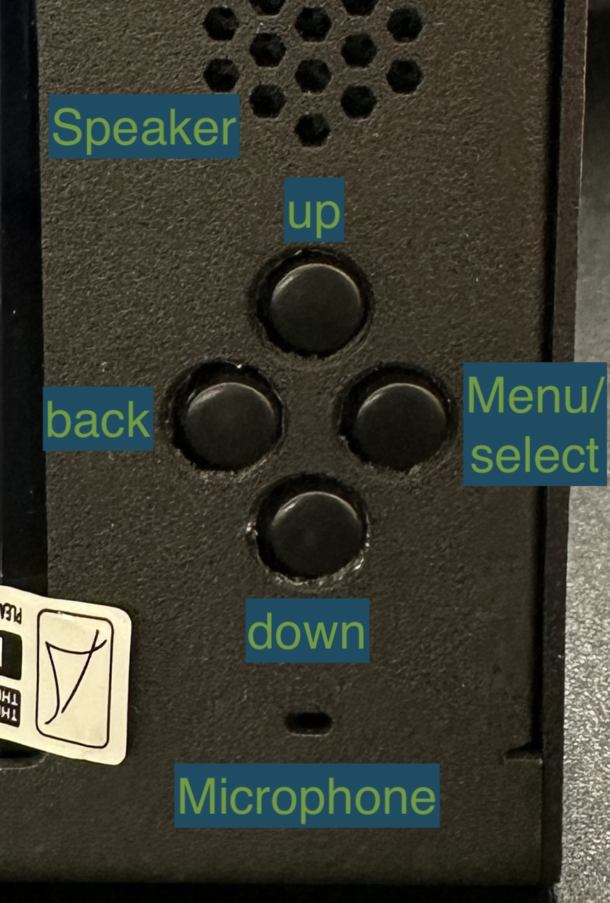

# AI in a Box.

AI in a Box from [Useful Sensors](https://usefulsensors.com/) showcases
speech-based AI applications.  All models are on-device and run locally with
no internet connection so are private by design.  It can be ordered from
[Crowd Supply](https://www.crowdsupply.com/useful-sensors/ai-in-a-box)
and will ship with a bootable microSD card containing Ubuntu server operating
system and all application code.

We describe the models used in AI in a Box
[below](#model-details).  This repo provides the open source code and optional
installation steps to rebuild the microSD card.

We do not plan to maintain this repo and encourage interested parties to make
forks.

- [AI in a Box.](#ai-in-a-box)
- [Quick start.](#quick-start)
  - [Connectors and buttons.](#connectors-and-buttons)
  - [Support for external devices.](#support-for-external-devices)
- [Logging in remotely](#logging-in-remotely)
- [Optional Installation.](#optional-installation)
  - [Quick installation.](#quick-installation)
  - [Full installation.](#full-installation)
    - [Boot and initial sanity checks.](#boot-and-initial-sanity-checks)
    - [Software.](#software)
    - [Model download and extraction.](#model-download-and-extraction)
    - [Permissions for scripts.](#permissions-for-scripts)
    - [Test run AI in a Box.](#test-run-ai-in-a-box)
    - [Startup service.](#startup-service)
    - [Optional steps.](#optional-steps)
- [Model details.](#model-details)
- [Contributors.](#contributors)

# Quick start.

AI in a Box has three speech driven modes with different display layouts.

| Mode      | Wake word(s)       | Notes                                             |
| --------- | ------------------ | ------------------------------------------------- |
| Caption   | "caption"          | Transcription in English.  USB keyboard.          |
| Chatty    | "chatty"           | Answers questions in English.  LLM 4-bit weights. |
| Translate | "translate x to y" | e.g.: translate French to German.                 |

Quick start: apply power to the **top** USB-C connector to boot AI in a Box.
The side USB-C connector does not support powering the box.


After around 60 seconds "Ready..." appears on the display.


AI in a Box is now listening for speech.  This is caption mode with continuous
transcription in English.


Chatty mode answers questions in English.


Translate mode translates speech in a choice of languages.


The selection of translation languages is defined in
`lang_to_flores200_dict` in this [code](/state_machine.py).  It uses specific
font typefaces for Chinese, Japanese, Korean and Thai languages based on this
[code](/fontfile.py).  All other selectable languages use a default Latin font.

## Connectors and buttons.

The **top** USB-C connector powers AI in a Box. The side USB-C connector
does not support powering the box.


There are four buttons for navigating the modes and menu:
* Up/Down keys toggle between the three [modes](#quick-start).
* Right key triggers a pop-up menu for volume and language selection.
  * use Up/Down to navigate and Right key to select.
  * use Left key to navigate back.



The volume selection `[0, 100]` is retained when rebooted.  Our default value is
`50` and `0` mutes the speaker.

The LAN connector is not used in normal AI in a Box operation.  It is used to
rebuild the microSD card if desired.


Optional USB-C keyboard for caption mode transcription in English.  This side
USB-C connector does not support powering AI in a Box.


Rock 5A board USB-A and LAN connectors are exposed.

## Support for external devices.
* Power supply of at least 20 W to the top connector.  For USB protocol details see Rock 5A [power](https://radxa.com/products/rock5/5a#techspec) support.
* Optional HDMI monitor requires reboot.  However some HDMI displays may not work for example 800x480 display resolution.  This connector and third-party cables may not function reliably as the connector is recessed.
* Optional USB keyboard requires a USB-C cable that supports data.  This side USB-C connector does not support powering AI in a Box.  USB keyboard has been tested on MacBook TextEdit application.  We ignore the MacOS pop-up prompt for the unknown keyboard layout.
* Headset audio jack is not supported by AI in a Box.
* USB audio devices are not supported by AI in a Box.  We added experimental script support for USB-A connected devices [here](/configure_devices.sh) but device selection is not reliable in our testing.
* LAN connector is only needed when rebuilding the microSD card with a [full installation](#full-installation).  It is not used in normal operation.

# Logging in remotely

If you do want to modify the underlying Linux installation, the box is running Ubuntu 22.04, with the username `ubuntu` and password `ubunturock`. You can log in using SSH if you have a wired Ethernet LAN cable connected. We've found the easiest way to identify the IP address is with a command like `nmap -Pn -p22 --open 192.168.1.0/24` on a Mac computer. You can try to use a USB-A connected keyboard, but the prompt disappears quickly on boot, so the SSH option is easier. Once you're in you have root access, so you can make whatever changes you want. If you do want to revert to factory settings, you can look at the Quick Installation section below.

# Optional Installation.

This section is not required for AI in a Box ordered from
[Crowd Supply](https://www.crowdsupply.com/useful-sensors/ai-in-a-box).
Simply power the box and use it.  We provide this installation section for
people who need to rebuild the microSD memory card or experiment with code
on AI in a Box.

For this project we use Ubuntu OS server, specifically Jammy CLI b18 release
from
[here](https://github.com/radxa-build/rock-5a/releases).  This release was
marked "latest" avalable on 01/26/2024.  It is installed in the microSD images
described below.

The application is coded with Python scripts and runs Python3.10.

The microSD card images have username `ubuntu` and password `ubunturock` for
SSH.

## Quick installation.

Simply download this compressed
[image](https://storage.googleapis.com/download.usefulsensors.com/ai_in_a_box/ai_in_a_box_11gb_20240126.img.gz)
then flash to a 16GB or higher microSD card.
```console
cd
curl -L -O https://storage.googleapis.com/download.usefulsensors.com/ai_in_a_box/ai_in_a_box_11gb_20240126.img.gz
```
Flash the compressed image file `ai_in_a_box_11gb_20240126.img.gz` using
[BalenaEtcher](https://etcher.balena.io/) or other method.

Insert the flashed microSD card in AI in a Box after removing the four screws
securing the rear panel.  Connect USB-C power to boot AI in a Box into the
caption mode.

## Full installation.

AI in a Box hardware has custom hardware for the display and audio and USB
keyboard.  For the full installation we provide a baseline microSD card image
with the OS and needed overlays and configuration for the custom hardware.  You
will also need GitHub access to complete these steps.

This baseline image does not include our application code which is added during
this installation.  The preparation of this image is not documented in this
repo.  It was created on a Sandisk A1 16GB microSD card (SDSQUAR-O16G-GN6MN
with 15,931,539,456 Bytes storage).

Download this
[compressed image](https://storage.googleapis.com/download.usefulsensors.com/ai_in_a_box/ai_in_a_box_baseline_16gb_20240125.img.gz).
```console
cd
curl -L -O https://storage.googleapis.com/download.usefulsensors.com/ai_in_a_box/ai_in_a_box_baseline_16gb_20240125.img.gz
```
Flash the compressed image file `ai_in_a_box_baseline_16GB_20240125.img.gz`
using BalenaEtcher or other method to a microSD card.  The image file is not
needed for the rest of this installation.

Insert the flashed microSD card into AI in a Box after removing the four screws
securing the rear panel.

### Boot and initial sanity checks.

Connect AI in a Box to LAN network and power-up using the provided USB-C
charger.  A prompt will appear on the display.

Identify the IP address with command `nmap -Pn -p22 --open 192.168.1.0/24` on a
Mac computer, or with a USB keyboard and `ip a` command.  Login through SSH
with `ubuntu` / `ubunturock`.

Optional: check custom hardware interfaces are available with these commands.

For input device check for
`<alsa_input.platform-uctronics-sound.stereo-fallback>`.
```console
pacmd list-sources | grep -e 'name:' -e 'index:' -e 'spec:'
```

For output device check for
`<alsa_output.platform-uctronics-sound.stereo-fallback>`.
```console
pacmd list-sinks | grep -e 'name:' -e 'index:' -e 'spec:'
```

For serial port needed for the USB keyboard feature check `/dev/ttyS6`.
```console
ls /dev/ttyS*
```

### Software.

Setup GitHub access with SSH Key or other and clone this repo.
```console
git clone git@github.com:usefulsensors/ai_in_a_box.git --depth=1
```

Run installs including packages.
```console
cd
sudo apt update
sudo apt upgrade -y

sudo apt-get install -y pulseaudio
sudo apt-get install -y libasound-dev portaudio19-dev
sudo apt-get install -y libportaudio2 libportaudiocpp0
sudo apt install -y libegl-dev libegl1
sudo apt-get install -y python3-dev

sudo apt install -y python3.10 pip
sudo apt install -y python3-pygame

# Run pip install as root to allow booting into demo.
sudo python3 -m pip install -r ai_in_a_box/requirements.txt
```
During the above installs you may get prompted.
```bash
*** panfrost.conf.bak (Y/I/N/O/D/Z) [default=N] ?
```
If you see this prompt choose default `N`.

Check the memlock limits.
```console
sudo nano /etc/security/limits.conf

# Add these two lines before end, uncomment and save.
#*               soft    memlock         unlimited
#*               hard    memlock         unlimited
```


### Model download and extraction.

The five models used on AI in a Box are outlined [below](#model-details).

We download ~ 3 GB of archives over the internet and move to locations on the
card.  This step is best run inside a terminal multiplexer such as `tmux`
in case the SSH session disconnects.  Sudo password
`ubunturock` is needed during the first install.

```console
cd
ai_in_a_box/get_model_archives.sh
```
After download readme files and licence texts are in `models/` folder, model
files are in `downloaded/` folder.


### Permissions for scripts.

This script configures audio devices and is used in launcher script.
```console
cd
chmod +x ai_in_a_box/configure_devices.sh
```

This script is the launcher for AI in a Box boot.
```console
cd
chmod +x ai_in_a_box/run_chatty.sh
```

### Test run AI in a Box.

We can make a test run of AI in a Box.  This step is optional and you may
proceed to the [next section](#startup-service).

First reboot AI in a Box after above installation.
```console
sudo reboot
```

SSH back in to AI in a Box and start the launcher script.
```console
cd
sudo ai_in_a_box/run_chatty.sh
```
AI in a Box takes around 60 seconds to start caption mode `Ready...`.  Note the
launcher script is run with superuser privileges.

Ignore this error in the SSH session.
```bash
/usr/local/lib/python3.10/dist-packages/pygame_menu/sound.py:204: UserWarning: sound error: No such device.
  warn('sound error: ' + str(e))
```
The above error is superceded with this log status.
```bash
audio input stream started successfully: True
```

If needed we can exit the application in another SSH session with this
command.
```console
sudo pkill -9 python
```
AI in a Box now displays Ubuntu's console prompt.

### Startup service.

This section describes how to configure AI in a Box to boot to the application.

Create a startup service.  It will be run as superuser.
```console
sudo nano /etc/systemd/system/run-chatty-startup.service
```

Add this text and save.
```bash
[Unit]
Description=AI in a Box Startup Service

[Service]
ExecStart=/bin/sh -c '/home/ubuntu/ai_in_a_box/run_chatty.sh > /tmp/run_chatty_log.txt 2>&1'
WorkingDirectory=/home/ubuntu
StandardOutput=file:/tmp/run_chatty_log.txt
StandardError=file:/tmp/run_chatty_log.txt

[Install]
WantedBy=default.target

```

Reload the Systemd configuration and enable the service to auto start.
```console
sudo systemctl daemon-reload
sudo systemctl enable run-chatty-startup
```

AI in a Box does not need any LAN internet connection following this step.
```console
sudo reboot
```
AI in a Box will boot into [caption mode](#quick-start) `Ready...` after
about 60 seconds.  Speak to the box to see a transcription on the display.

The full installation is now complete.

You may now remove and reinsert the USB-C power to hard boot AI in a Box.

### Optional steps.

Optional: we reduced our
[quick installation](#quick-installation) image size using third-party tools
`gparted` to reduce the microSD card partition size and `DD` to clone the image
to ~ 11GB.  This step is optional.  If your workflow requires this we recommend
leaving at least 1GB of unused space to run AI in a Box.

Optional: inspect the application log in an SSH session.
```console
watch -n 1 tail -n 20 /tmp/run_chatty_log.txt
```

Optional: remove the system startup configuration in an SSH session if booting
into AI in a Box application is not wanted.
```console
sudo systemctl disable run-chatty-startup
sudo rm /etc/systemd/system/run-chatty-startup.service
```

Optional: remove GitHub SSH key authentication and configuration.
```console
rm ~/.ssh/*
git config --global user.email ""
git config --global user.name ""
```

# Model details.

We provide copies of all models used in AI in a Box each with license, original
source URL and readme in compressed tarball archive files - details for
each archive file are provided in this table.

During the full installation above we used this
[script](/get_model_archives.sh) to automate the download and extraction onto
the AI in a Box microSD card.

| Name and source URL              | download URL | microSD location | Task                       |
| -------------------------------- | ------------ | ------------------- | --------------------------------------- |
| [useful-transformers_wheel.tar.gz](https://github.com/usefulsensors/useful-transformers) | [link](https://storage.googleapis.com/download.usefulsensors.com/ai_in_a_box/useful-transformers_wheel.tar.gz) | python3.10 package  | Speech to text in all modes       |
| [nllb-200-distilled-600M.tar.gz](https://huggingface.co/facebook/nllb-200-distilled-600M)   | [link](https://storage.googleapis.com/download.usefulsensors.com/ai_in_a_box/nllb-200-distilled-600M.tar.gz) | downloaded/         | Language translation for translate mode |
| [orca-mini-3b.tar.gz](https://huggingface.co/TheBloke/orca_mini_3B-GGML)              | [link](https://storage.googleapis.com/download.usefulsensors.com/ai_in_a_box/orca-mini-3b.tar.gz) | downloaded/         | Large language model for chatty mode  |
| [piper_tts_en_US.tar.gz](https://github.com/rhasspy/piper)           | [link](https://storage.googleapis.com/download.usefulsensors.com/ai_in_a_box/piper_tts_en_US.tar.gz) | downloaded/         | Text to speech (TTS) for chatty mode  |
| [silero_vad.tar.gz](https://github.com/snakers4/silero-vad)                | [link](https://storage.googleapis.com/download.usefulsensors.com/ai_in_a_box/silero_vad.tar.gz) | downloaded/         | Voice activity detection in all modes |


# Contributors.
* Nat Jeffries (@njeffrie)
* Manjunath Kudlur (@keveman)
* William Meng (@wlmeng11)
* Guy Nicholson (@guynich)
* James Wang (@JamesUseful)
* Pete Warden (@petewarden)
* Ali Zartash (@aliz64)
